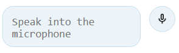

# Speech to Text

**Speech to Text** is an application developed using the [Jenyx](https://github.com/jenyxjs/jenyx) library. It provides a user-friendly interface to convert speech into text using modern web technologies.

The screenshot below demonstrates the main interface of the Speech to Text application:

To see the application in action, visit the [live demo](https://jenyxjs.github.io/speech-to-text/www/app.html).